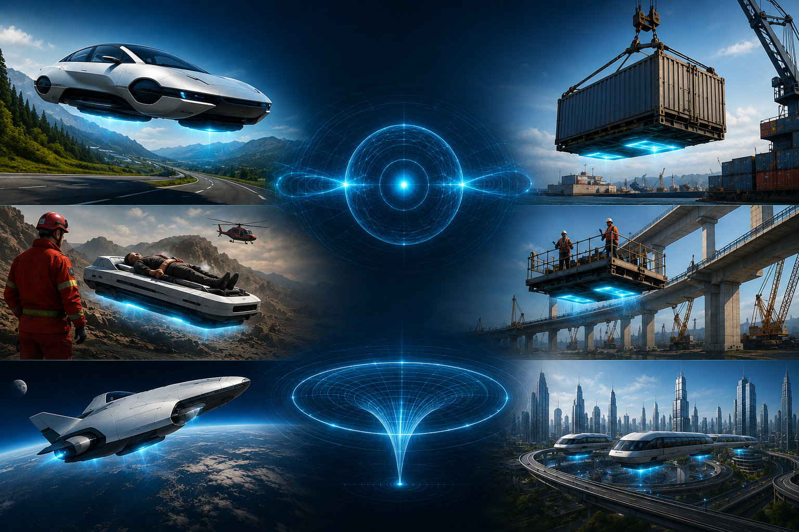

# Graviton Drive

The Graviton Drive is a conceptual research project exploring how future graviton-based technologies could transform transportation, logistics, construction, emergency response, humanitarian operations, aerospace and infrastructure.

Rather than presenting a finished technology, this project illustrates potential applications that could become possible if controlled gravitational manipulation were ever achieved.

The aim is to encourage discussion, stimulate engineering thought, and provide practical examples of how such a technology might benefit society.

## Live Website

[https://gravitondrive.com](https://gravitondrive.com/)

## Project Overview

Example applications include:

- Floating cargo transport

- Humanitarian aid and disaster response

- Construction and infrastructure maintenance

- Elevated work platforms

- Medical evacuation and patient transport

- Mobility assistance

- Transportation systems

- Industrial lifting and logistics

- Aerospace concepts

The website contains concept illustrations and descriptions intended to demonstrate possible future uses of graviton-based technology.

## Related Research

This project complements my published research into photon stress, graviton generation, and black hole dynamics.

Related publications are available through:

- GitHub

- Zenodo

- Open Science Framework (OSF)

Links are provided from the project website.

## Status

This is an ongoing conceptual research project.

The concepts, illustrations and examples will continue to evolve as additional ideas and research are developed.

## Author

**Jason Webb**

Independent Researcher  
Te Haurapa Research Labs (New Zealand)

Website: [https://trackinman.com](https://trackinman.com/)

## Licence

Unless otherwise stated, the content of this repository is released under the **Creative Commons Attribution 4.0 International (CC BY 4.0)** licence.

